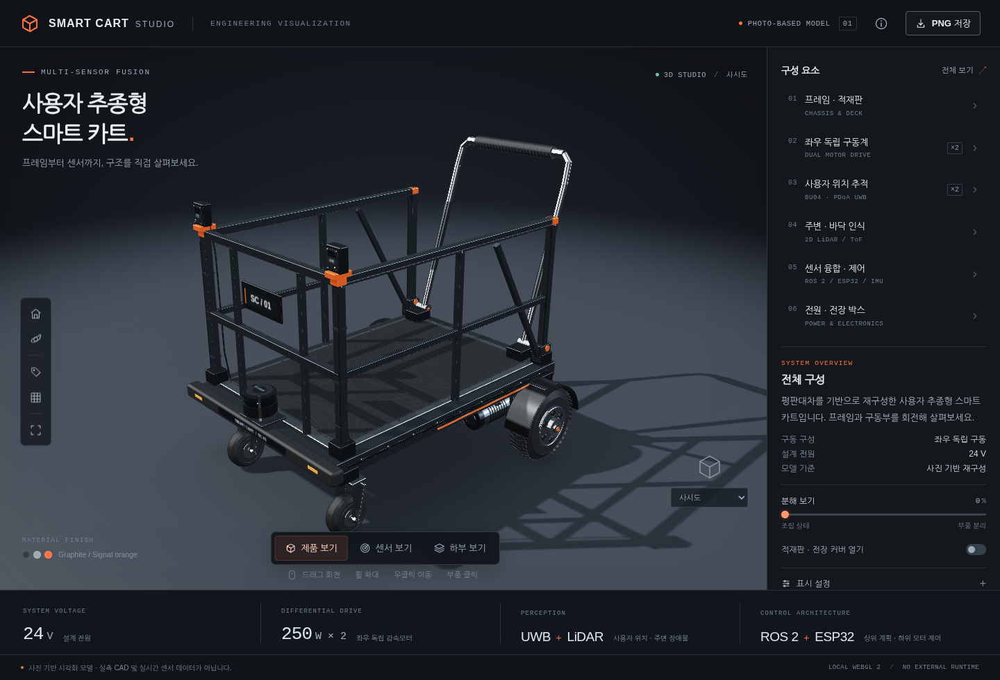

# Smart Cart Studio

[English](README.md) | [한국어](README-KR.md)

A dependency-free, static WebGL 2 viewer for a photo-based reconstruction of a multi-sensor, user-following smart cart. This package splits the existing single HTML into HTML, CSS, JavaScript, and image assets without changing the rendering or interaction code.



*Preview supplied with the original single-HTML version. This is not a new rendering-validation screenshot.*

## Run locally

Extract the entire archive and keep the folder structure intact. From the project folder, run:

```sh
python -m http.server 8000
```

Open `http://localhost:8000/`. On Windows, `py -m http.server 8000` is an alternative when the Python launcher is installed. The Python server is only for local preview; it is not a production dependency.

There is no npm installation, bundler, build step, API key, CDN, or backend. The viewer requires JavaScript and a browser/device capable of creating a WebGL 2 context. An HTTP server is the recommended local-preview method; this release does not claim a new `file://` compatibility test.

## Publish on GitHub Pages

1. Upload the **contents** of this folder to your repository root. `index.html` must be at the root, alongside `css/`, `js/`, `assets/`, and `.nojekyll`. Do not upload only the ZIP or place the whole project one extra folder below the intended publishing root.
2. In **Settings > Pages > Build and deployment**, set **Source** to **Deploy from a branch**.
3. Choose the branch containing these files, normally **main**, select **/(root)**, and save.

Use the site URL shown in the repository's Pages settings. A project site's usual URL shape is:

```text
https://<username>.github.io/<repository>/
```

All application assets use `./` paths. The site does not hard-code a username, domain, repository name, or root-relative `/js/` or `/css/` path. No custom Actions workflow is required for this branch-based setup. The `.nojekyll` file marks the static output for publishing without Jekyll processing.

Official instructions: [Configure a publishing source](https://docs.github.com/en/pages/getting-started-with-github-pages/configuring-a-publishing-source-for-your-github-pages-site) and [Create a GitHub Pages site](https://docs.github.com/en/pages/getting-started-with-github-pages/creating-a-github-pages-site).

This archive does not upload, push, or publish anything to your GitHub account.

## Project structure

```text
Smart-Cart-Studio/
  index.html                 Page structure and ordered script references
  .nojekyll                  Static GitHub Pages publishing marker
  .gitignore
  css/
    styles.css               Existing styles and responsive breakpoints
  js/
    math.js                  Vector, matrix, transform, and color utilities
    geometry.js              Procedural primitive geometry and mesh builder
    cart-model.js            Cart assembly, materials, labels, and metadata
    renderer.js              WebGL 2 shaders, camera, rendering, and picking
    app.js                   UI events, viewer state, dialogs, and PNG export
  assets/
    icons/favicon.svg
    images/reference.jpg     Original embedded reference image, decoded once
    images/preview.png       Preview from the original single-file release
  docs/
    QA.md                    Verification scope and limitations
    refactor-manifest.json   Source and extracted-file SHA-256 hashes
  tests/
    validate.mjs             Optional dependency-free static/model checks
  README.md
  README-KR.md
  CHANGELOG.md
```

The five JavaScript files retain the original `window.CartLab` namespace and load in the order above with classic `defer` scripts. Do not add `async`, reorder the files, or individually change them to `type="module"` without refactoring their dependencies. This package preserves the native WebGL 2 renderer; it does not replace it with Three.js.

## Preserved viewer controls

Drag to orbit, use the wheel to zoom, and right-drag to pan. Touch gestures provide orbit, pinch-to-zoom, and two-finger pan. Product, sensor, and underside modes, component selection, exploded assembly, cover opening, camera presets, labels, grid, automatic rotation, studio theme, exposure, quality, reference/help dialogs, fullscreen requests, and PNG export remain in the original code.

Keyboard: `0` resets the view; `1`, `2`, and `3` select product, sensor, and underside views; `A`, `L`, and `G` toggle automatic rotation, labels, and the grid.

## Verification

With Node.js installed, optionally run:

```sh
node tests/validate.mjs
```

This checks script syntax/order, relative asset paths, asset existence, and actual procedural model generation. It does not require npm dependencies and is not needed to deploy or run the site.

The split JavaScript and CSS match the original inline contents exactly. The generated vertex buffer and component metadata also match. Local HTTP asset checks and browser resource-loading checks passed. The current test environment could not create a WebGL 2 context for either the original or split version, so new GPU-rendering and interaction tests are **not** claimed. See [QA report](docs/QA.md) and [changelog](CHANGELOG.md).

## Troubleshooting

A Pages 404 usually requires checking the selected publishing branch/folder and the location of `index.html`. An unstyled page or missing script requires checking that all folders were uploaded, names match exactly, and requests to `css/styles.css`, `js/app.js`, and the other referenced files succeed. Keep `.nojekyll` when committing through Git. After updating an existing site, reload without cached assets.

When the viewer shows a WebGL initialization error, verify browser graphics acceleration and WebGL 2 availability on the actual device. The original fallback message and disabled capture button are retained. A successful HTML response alone is not proof that a device can render WebGL 2.

## Model scope

This is a procedural reconstruction from the supplied FreeCAD screenshot and project description, not an imported FreeCAD/STEP model. Dimensions, hidden geometry, sensor housings, and some placements are visual assumptions. Sensor rays and the user tag are explanatory graphics, not live measurements. This website does not execute ROS 2, connect to sensors, command motors, or validate structural, braking, rider, or rollover safety. No new license has been assigned by this packaging change.
